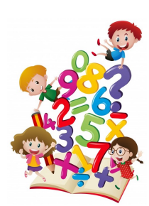

# Maximum Number  
  

The *maximum number* game  is  played  in  primary  school,using  a  set  of  sticks,  each  one  with  a  number  engraved.There may be several sticks with the same number.  Sticksare  previously  hidden  in  the  courtyard.   When  the  gamestarts, children have a few minutes to pick them. Then, theyreturn  to  the  classroom  and  must  identify  the  maximumnumber carved on the sticks collected by all of them.  
## Task  
Given the sticks picked by the children, the goal is to findout the maximum number carved on them.  It is guaranteedthat,  for  the  given  inputs,  some  child  picked  at  least  onestick.InputThe first line of the input has one positive integer,C,  which is the number of children.Each of the followingClines specifies the sticks picked by a child.  The line contains thenumber of sticks collected by the child,S, followed bySintegers, which are the numbersengraved on the sticks.Integers on the same line are separated by a single space.  Any number carved on astick fits in a normal signed 32 bit integer.  
## Constraints  
- 1≤C≤300 000    (Number of children)
- 0≤S≤10(Number of sticks picked by a child)   
## Output  
The output has a single line with the maximum number carved on the sticks collected byall children.  
## Sample Input  

``` 
4  
3 5 12 2  
0  
3 25 5 17  
5 2 4 2 10 21  
```  

## Sample Output  

``` 
25  
```

# Solution 
``` java 
import java.io.*;
public class MaximumNumber{
  public static void main(String[] args) throws IOException
    {
        BufferedReader s= new BufferedReader(new InputStreamReader(System.in));
        int max = Integer.MIN_VALUE;         //minimo valor possivel
        int c;        
        int ns;
        String[] sticks;
        int nc = Integer.parseInt(s.readLine());
        for(int i = 0;i<nc;i++){
          sticks= s.readLine().split(" ");
           ns= Integer.parseInt(sticks[0]);
          for(int j = 1;j <= ns;j++){
            c = Integer.parseInt(sticks[j]);
            if(max<c){
              max=c;
            }
          }
        }
        s.close();
        System.out.println(max);
    }
}
```
