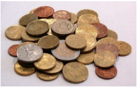

# Troco de moedas  

*Versão simplificada* 

Em Algoland todos os habitantes sabem usar algoritmos avan¸cados. Não é por isso de espantar que
tivessem escolhido um sistema de moedas cuidadosamente preparado ser diferente do habitual. De facto,o típico algoritmo greedy de ir escolher sempre a maior
moeda ainda inferior ou igual à quantia restante não funciona por lá, e os seus habitantes divertem-se ao ver a dificuldade que os visitantes têm em conseguir perceber que moedas devem usar quando fazem pagamentos.  
&emsp; O Aniceto vai visitar um amigo em Algoland e já decidiu que não quer passar nenhuma
vergonha. Ele sabe exactamente que moedas existem e as compras que vai fazer, e como
pode trocar dinheiro antes de ir, consegue sempre ter moedas em quantidade suficiente. A
maior dificuldade dele é saber o mínimo número de moedas para fazer as quantias de cada
compra, sendo que pode repetir quantas vezes quiser a mesma quantia de moeda.  
&emsp;Imagina por exemplo que em Algoland existem as moedas de 1, 5, 8 e 11 cêntimos. Se
o Aniceto quisesse fazer a quantia de 13 cêntimos bastavam duas moedas (5+8). Já para
fazer 20 eram precisas 3 (1+8+11). Por seu lado, uma quantia como 51 já necessitava de 6
moedas (5+5+8+11+11+11).  
&emsp;O Aniceto já está com uma grande dor de cabe¸ca de tantas contas que está a fazer e por
isso precisa de ajuda. . .  

## O Problema
Escreva um programa que dado um conjunto de N moedas e uma série de P perguntas, cada
uma indicando uma quantia Qi , indique qual o menor número de moedas necessário para
fazer cada quantia,<s> e quais as moedas a usar em cada caso.</s>  
&emsp;Pode assumir que todas as quantias são possíveis de fazer e que tem uma quantidade
“infinita” de cada moeda, ou seja que para fazer o mínimo pode repetir qualquer valor de
moeda tantas vezes quanto o necessário.
## Input
Na primeira linha vem um número N, indicando o número de tipos de moedas em Algoland.
Na segunda linha vêm N inteiros Ti
, indicando quais os valores de cada tipo de moeda. Pode
assumir que as moedas vêm por ordem crescente.
Na terceira linha vem um único inteiro P indicando o número de perguntas a considerar.
Nas P linhas seguintes vêm as perguntas em si, cada uma com um inteiro Qi
indicando a
quantia para a qual se quer minimizar o número de moedas a usar.
1  
## Output
P linhas, cada uma com a resposta da pergunta respectiva. Cada linha deve vir no formato
“Qi: [MIN]”, onde MIN é o número mínimo de moedas a usar para fazer a quantia Qi.
## Restrições
São garantidos os seguintes limites em todos os casos de teste que irão ser colocados ao
programa:  
1 ≤ N ≤ 100 Quantidade de tipos de moedas  
1 ≤ Ti ≤ 10 000 Valor de cada tipo de moeda  
1 ≤ P ≤ 100 Quantidade de perguntas  
1 ≤ Qi ≤ 200 000 Quantia para a qual se quer minimizar o número de moedas a usar   

## Exemplo de Input  

``` 
4
1 5 8 11
6
13
20
53
19
98
42
```  

## Exemplo de Output  

``` 
13: [2]
20: [3]
51: [6]
19: [2]
98: [10]
42: [5]
```  

## Explicação do Input/Output
O exemplo de input corresponde ao conjunto de tipos de moedas descrito no enunciado: 1,
5, 8 e 11 cêntimos.
- Para fazer a quantia 13 bastam duas moedas (5+8)
- Para fazer a quantia 20 bastam três moedas (1+8+11)
2
- Para fazer a quantia 51 bastam seis moedas (5+5+8+11+11+11)
- . . .
## Autor
Pedro Ribeiro @ DCC/FC/UP (autor da versão original)  
## Solução  
```java
    import java.io.*;


class Main {
    public static void main(String[] args) throws IOException
    {
        BufferedReader br= new BufferedReader( new InputStreamReader(System.in));
        Coins algoland = new Coins(Integer.parseInt(br.readLine()));
        String[] values=br.readLine().split(" ");
        algoland.setValues(values);;
        int numChanges = Integer.parseInt(br.readLine());
        int amount;
        for(int i=0;i<numChanges;i++){
            amount=Integer.parseInt(br.readLine());
            System.out.println(amount+": "+"["+algoland.change(amount)+"]");
        }
  
    }
  }

  class Coins {
    int[] coinsValues;
    int numCoins;
    public Coins(int coins){
        this.numCoins=coins;
        coinsValues= new int[coins];
    }

    /* Inicializa os valores das moedas existentes. */
    public void setValues(String[] values){
        for(int i =0; i<coinsValues.length;i++){
            coinsValues[i]=Integer.parseInt(values[i]);
        }
    }

    /*
  Calcula e devolve o número mínimo de moedas necessário para
  obter a quantia AMOUNT.
    */
    public int change(int amount){
        int[] coins=new int[amount+1];
        coins[0]=0; //Caso Base
        for(int i=1;i<=amount;i++){
            coins[i]=i/coinsValues[0];
            //System.out.println(i+" "+coins[i]);
            for( int j=0;j<numCoins;j++){
                if(coinsValues[j]<=i && 1+coins[i-coinsValues[j]]<coins[i]){
                    coins[i]=1+coins[i-coinsValues[j]];
                }
            }
        }
        return coins[amount];
    }
  }
 ```