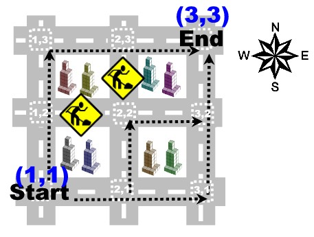

# All the ways. . .   
Modern city planning favours rectangular street layouts, like the one found in downtown Manhattan. Streets and avenues are designed to intersect perpendicularly with each other and, viewed from above, large areas of the cities look just like grids. Since the distinction between streets and avenues is of no consequence, we will call them all roads and, usually,you may follow any road in both directions, either North and South or East and West.  
&emsp;Sometimes, a segment of road, between two intersections, must be closed to traffic. This happens due to a variety of reasons, including traffic accidents, road works and terrorist threats. When this happens, we say that there is a blockage on that road
segment.
  
In most cases, there are many different ways you may go when you want to travel from some given intersection S to some other intersection E. The challenge that lies before you is to compute exactly how many ways there are, subject to the condition that you may only travel in the North and East directions, and taking into account the blockages present on the grid. Intersections are identified by a pair (x, y) of coordinates, where x is the number of the North/South road, counted from West to East, and y is the number of the East/West road, counted from South to North, that cross at the intersection.  
&emsp; In the example depicted in the figure, the starting intersection S is labelled as **Start**, and its coordinates are (1, 1), as it corresponds to the intersection between the first North/South road and the first East/West road. The ending intersection E, labelled **End**, has coordinates (3, 3) and there are exactly 3 different ways to travel from S to E, given the blockages marked by the roadworks signs.  

## Task
Given a square grid of size R × R of roads, a starting intersection S = (Sx, Sy) and an ending intersection E = (Ex, Ey), your task is to count how many ways there are to go from S to E only travelling North and East. You may assume that there will always be at least one way to travel between the starting and the ending intersections.   
## Input   
The input will consist of one or more independent test cases and the first line of input contains a positive integer C that represents the number of test cases that follow.   
&emsp; Each test case starts with a line containing the number R of North/South and East/West roads.   
&emsp;This line is followed by a line containing the coordinates Sx and Sy of the starting intersection, and by a line containing the coordinates Ex and Ey of the ending intersection, separated by a single space.    
&emsp;The next line contains the number B of blockages (limited by the size of the grid) that exist on the grid. The following B lines, describe the blockages. Each blockage is defined by the coordinates Px and Py of one intersection, followed by a symbol D in {N, E, S, W}, meaning that traffic is closed on the road segment that starts in direction D with respect to intersection (Px, Py). The three values are separated by single spaces.  
## Constraints
0 < C ≤ 1 000 Number of test cases  
1 < R ≤ 30 Number of North/South and of East/West roads  
1 ≤ x, y ≤ R Coordinates of the intersections  
0 ≤ B ≤ 500 Number of blockages    ~

## Output
For each input case your program must output a line indicating the number of ways you can go from the starting to the ending intersections, given that you are only allowed to travel North and East.   
&emsp;You may assume that the number of ways to go from the starting to the ending intersections is always strictly less than  .  
## Sample Input 1  
This sample input has a single test case, that corresponds to the figure above.
1  
3  
1 1  
3 3  
2  
2 3 S  
2 2 W  
## Sample Output 1  
3  
## Sample Input 2  
2  
3  
1 1  
3 3  
0  
20  
1 1  
20 20  
2  
10 10 N  
10 10 E  
## Sample Output 2  
6  
26362427080  
## Solução  
``` java
   
 ```
