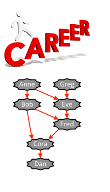

# Problem 6 : Promotions  
  

The Fair Inc. administration decided to promote the best employees and limited the number of promotions to a fixed interval [A, B]. The directors compared the employees’ performance and their evaluations resulted in a consistent precedence relation among employees, which has to be respected by promotions. This means that, for every pair of employees x and y, if x outperformed y, then y may be promoted only if x is promoted. In order to understand whether the data collected so far is enough for ensuring fairness, the executive chairman wants to know:  

- How many employees will certainly be promoted in the interval endpoints (i.e., if the number of promotions is A and if the number of promotions is B).  
- How many employees have no possibility of being promoted (even if the number of promotions is B).  

Consider the example depicted in the figure. There are seven employees and eight precedence rules. An arrow from an employee x to an employee y means that x outperformed y. The number of promotions is limited to the interval [3, 4]. Therefore:  

<ul>
    <li> If there are only three promotions, the promoted employees must be:
        <ul>
            <li>either Anne, Bob and Greg,</li>
            <li>or Anne, Eve and Greg.</li>
        </ul>
        In this case, two employees (Anne and Greg) will certainly be promoted. Notice that, with the current information, Bob and Eve may or may not win a promotion.
    </li>
    <li>If there are four promotions, the promoted employees have to be:
       <ul>
            <li> Anne, Bob, Eve and Greg.</li>       
       </ul>    
       So, with four promotions, four employees (Anne, Bob, Eve and Greg) will certainly be promoted and three employees (Cora, Dan and Fred) have no possibility of being promoted. 
    </li>
</ul>  


## Task  
Write a program that, given the interval of the number of promotions, the set of employees and the precedence relation among them, computes, for each of the interval endpoints, the number of employees that will certainly be promoted, and the number of employees that have no possibility of being promoted.   
The precedence relation is consistent in the sense that, if an employee x outperformed an employee y, y did not outperform (directly or indirectly) x.  

## Input  
The first line of the input has four space separated integers: A, B, E, and P. A and B are the interval endpoints, E is the number of employees and P is the number of precedence rules. Employees are identified by integers, ranging from 0 to E − 1.  
 Each of the following P lines contains two distinct space separated integers, x and y, which indicate that employee x outperformed employee y.   

## Constraints  
- 1 ≤ A < B < E Interval endpoints.  
- 2 ≤ E ≤ 5 000 Number of employees.  
- 1 ≤ P ≤ 20 000 Number of precedence rules.   

##  Output  
The output consists of three lines. The first line contains the number of employees that
will certainly be promoted if there are A promotions. The second line contains the number
of employees that will certainly be promoted if there are B promotions. The third line
contains the number of employees that have no possibility of being promoted (even if there
are B promotions).  

## Sample Input    

```
3 4 7 8
0 4
1 2
1 5
5 2
6 4
0 1
2 3
4 5
 ```

## Sample Output

``` 
2
4
3
```

## Solução  

```
import java.io.*;
import java.util.*;

class Main {
    static BufferedReader br = new BufferedReader (new InputStreamReader(System.in));
    static String[] aux;
    static int A;
    static int B;
    static int E;
    static int P;  
    public static void main(String[] args) throws IOException
    {
        aux= br.readLine().split(" ");
        A = Integer.parseInt(aux[0]);
        B = Integer.parseInt(aux[1]);
        E = Integer.parseInt(aux[2]);
        P = Integer.parseInt(aux[3]);
        Organisation a = new Organisation(E);
        for(int i = 0; i< P; ++i){
          aux=br.readLine().split(" ");
          a.setOutperformed(              //set vertex
            Integer.parseInt(aux[0]),
            Integer.parseInt(aux[1])
          );
        }
        Promotions c = a.promotions(A,B);
        System.out.println(c.mProm);
        System.out.println(c.MProm);
        System.out.println(c.NProm);

        

    }
  }
  
  /*
    Promotions é um objecto que contém o número de funcionários que
    serão certamente promovidos nos limites de um intervalo de possíveis
    promoções e o número de funcionários que não serão promovidos mesmo
    no limite superior do intervalo.
  */
  class Promotions {
    int min;
    int max;
    Organisation a;
    Boolean[] visited0;
    Boolean[] visited1;
    int MProm = 0;
    int mProm = 0;
    int NProm = 0;
    public Promotions(int min, int max, Organisation a){
      this.min=min;
      this.max=max;
      this.a=a;
      int actual;
      int df;
      for(int i =0; i < a.employees;++i){
        visited0= new Boolean[a.employees];
        visited1= new Boolean[a.employees];
        for(int j = 0; j < a.employees; ++j){
          visited0[j] = false; 
          visited1[j] = false; 
        }
        df = dfs(i,a.invertex,visited1);
        actual = a.employees-dfs(i,a.vertex,visited0)+1;
        if(actual <= min) 
          ++mProm;
          if(actual<= max)
          ++MProm;
        if(df > max)
          ++NProm;
      }
    }
    
    
    public int dfs(int emploee, List<Integer>[] vert, Boolean[] vis ){
      if(vis[emploee]){
        return 0;
      }
      else{
        vis[emploee]=true;
        int result=1;
        for(int i: vert[emploee]){
          result += dfs(i,vert,vis);
        }
        return result;
      }


    }
    
  }
  
  class Organisation {
    /*
      Cria uma organização com EMPLOYEES funcionários.
    */
    int employees;
    List<Integer>[] vertex;
    List<Integer>[] invertex;
    @SuppressWarnings("unchecked")
    public Organisation(int employees){
        this.employees=employees;
        vertex = new List[employees];
        invertex = new List[employees];
        for(int i = 0; i<employees;i++){ 
          vertex[i]=new ArrayList<Integer>();
          invertex[i]=new ArrayList<Integer>();
        }
    }
    public void setOutperformed(int employee, int other){
        vertex[employee].add(other);
        invertex[other].add(employee);
    }
  
    public Promotions promotions(int min, int max){
      Promotions a = new Promotions(min,max,this);
      return a;
    }
    public void print(){
      for (int i =0; i < employees;++i){
        System.out.println(i+" "+vertex[i]);
      }
    }
  }
```


