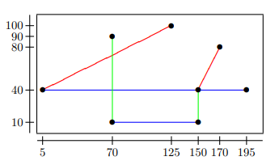
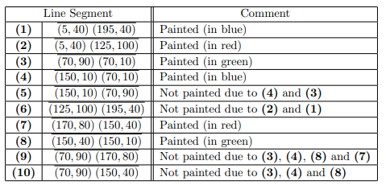

# Problem G: Polygon Phobia  
Bob is a young artist, whose current works are paintings with coloured line segments (like the one depicted
in the figure below). But Bob is phobic about polygons, he simply cannot draw any closed chain of line
segments.  
In his next painting workshop Bob has decided to try a new approach, “the luck of the draw”. He will
start by carefully choosing the possible line segments and by writing the two different endpoints of each
segment on a small piece of paper, just as if the painting canvas was a Cartesian coordinate system.
Then, all those pieces of paper will be put into a large jar, which will be very well shaken. At this point,
the painting process will begin, using his “luck of the draw” approach. Whilst the jar is not empty, Bob
will pick a piece of paper out of it, one at a time, and will then paint the corresponding line segment
unless it closes an existing chain (because of his phobia).  
Papers taken out of the jar will be put directly into the recycling bin.  
A segment p1 pn closes an existing chain if the painting already has segments of the form:  
p1 p2, p2 p3, p3 p4, . . . , pn−1 pn (for some n ≥ 3),  
where p q denotes the line segment whose endpoints are p and q. Notice that p q = q p. Notice also that
chains are defined by segment endpoints and not by line intersections. For instance:  
-  line segment (1, 1) (5, 1) closes the chain (1, 1) (5, 5), (5, 5) (5, 1), but  
-  line segment (1, 1) (6, 1) does not close the chain (1, 1) (5, 5), (5, 5) (5, 1).  
<center>
    
</center>

The figure shows the line segments Bob would paint if the pieces of paper picked from the jar contained
the line segments presented in the table, in the specified order.  
<center>
    
</center>

## Task  
Given a sequence of distinct line segments, each one defined by two different endpoints, the goal is to
find out how many line segments Bob would actually paint.  

## Input  
The first line of the input contains one integer, S, which is the number of (distinct) line segments. Each of
the following S lines contains four integers, x1, y1, x2, and y2, which indicate that (x1, y1) and (x2, y2) are
the endpoints of a line segment, defined in Cartesian coordinates. Integers in the same line are separated
by a single space.  

## Output  
The output has a single line with the number of line segments that Bob would paint.

## Constraints  

1 ≤ S ≤ 100 000 Number of line segments.  
0 ≤ xi < 1 000 Abscissa of a segment endpoint.  
0 ≤ yi < 1 000 Ordinate of a segment endpoint.

## Input example 1
```
10
5 40 195 40  
5 40 125 10  
70 90 70 10  
150 10 70 1  
150 10 70 9  
125 100 195  
170 80 150   
150 40 150   
70 90 170 8  
70 90 150 4 
```

## Output example 1
```
6 
```

## Input example 2
```
3  
5 7 15 7  
5 7 20 7  
10 7 20 7 
```

## Output example 2
```
3
```


